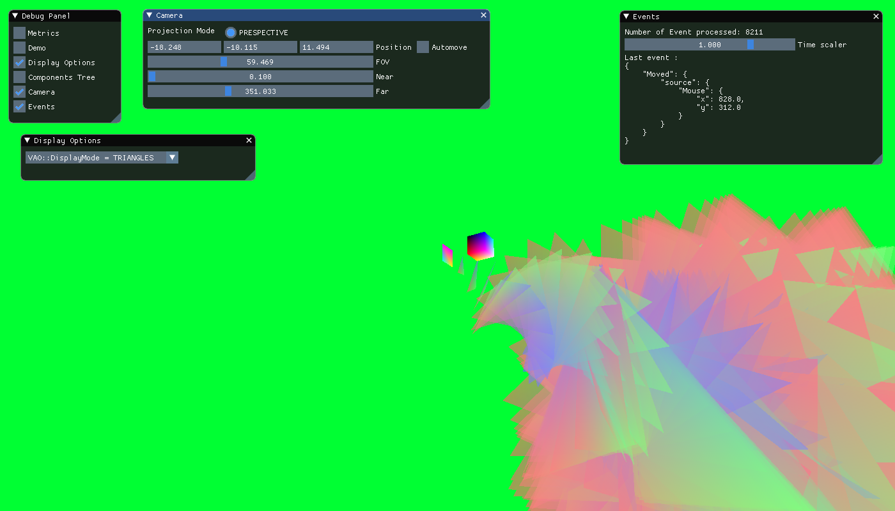
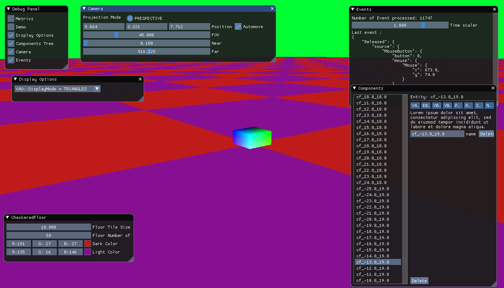

# EngineEngine

## Roadmap

* [x] setup main dependencies (glfw/glew/imgui/glm/entt)
* [x] create rendering window / shader
* [x] setup dynamic module (design core/api/module)
* [x] integrate vao/vbo/ebo in the ecs
* [x] add transform component (rotation/position/scale)
* [x] add imgui debug widget (entity/component)
* [x] buffered event polling
* [x] better abstraction of scene in module
* [x] add a camera (moveable mith mouse/widget)
  * [ ] handle multiple projection type
* [x] create device state (keyboard/mouse)
  * [ ] render debug widget
  * [ ] handle joysticks
* [ ] add component parent/children (and update widget)
* [ ] add event recording / playback (fifo/lifo)
* [ ] add light
* [ ] add texture
  * [ ] loading image
  * [ ] caching data
* [ ] handle camera viewport / window size
* [ ] create hitbox/collision
* [ ] ...

## Screenshot

